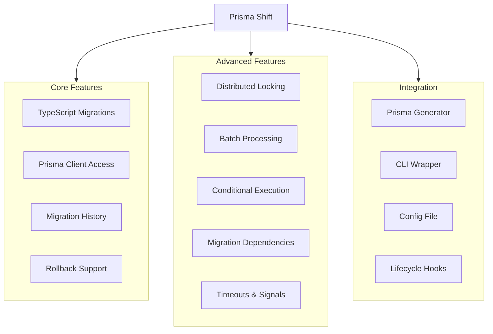
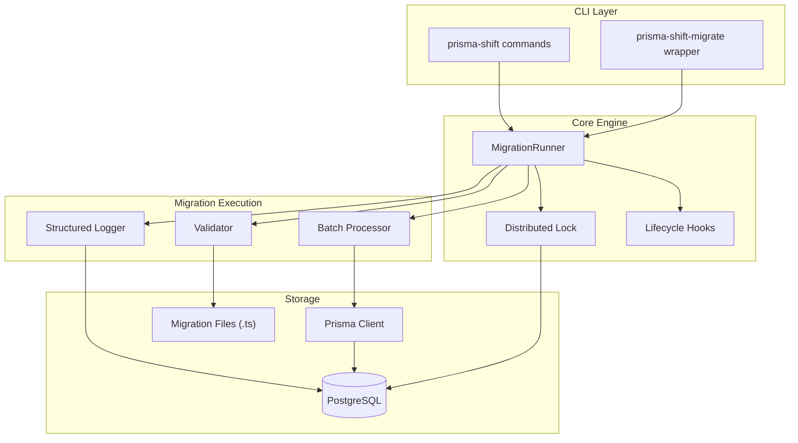
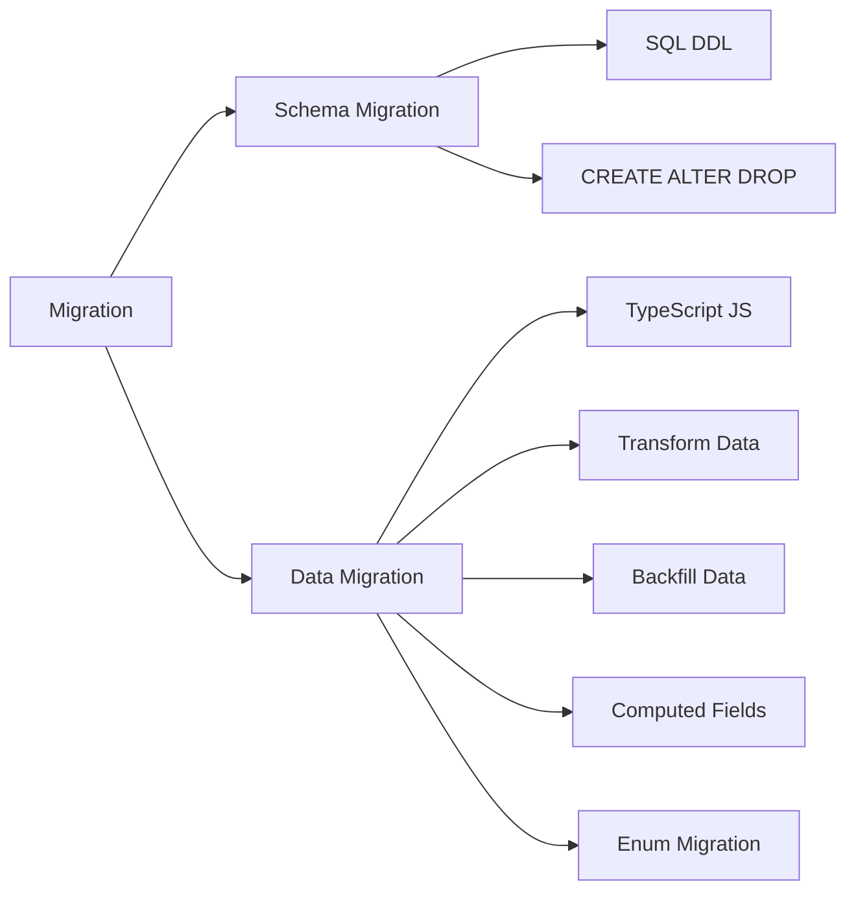

# Prisma Shift

**TypeScript-based data migrations for Prisma.**

Run data transformations alongside your schema migrations with full type safety and access to the Prisma Client.

---

🌐 **Live Documentation:** [https://eftech93.github.io/prisma-shift/](https://eftech93.github.io/prisma-shift/)

📊 **Test Report:** [View Latest Results](test-report.html)

---

## Why Prisma Shift?

Prisma's native migrations handle schema changes beautifully, but data migrations often require:

- 📝 **Running TypeScript/JavaScript code** for complex transformations
- 🗄️ **Using the Prisma Client** to query and update data
- 🔀 **Complex data transformations** that SQL can't handle elegantly
- 📊 **Maintaining migration history** with rollback capabilities
- 🚀 **Batch processing** for large datasets
- 🔒 **Preventing concurrent execution** in multi-instance deployments

---

## Features at a Glance

<div class="diagram">



</div>

---

## Quick Start

### 1. Install

```bash
npm install prisma-shift
```

### 2. Initialize

```bash
npx prisma-shift init
```

### 3. Create Migration

```bash
npx prisma-shift create "add_default_preferences"
```

### 4. Run Migrations

```bash
# Run everything (recommended)
npx prisma-shift run --with-schema

# Or wait for lock in multi-instance deployments
npx prisma-shift run --with-schema --wait
```

---

## Architecture Overview

<div class="diagram">



</div>

---

## Migration Types

<div class="diagram">



</div>

| Type | Purpose | Tool | Example |
|------|---------|------|---------|
| **Schema Migration** | Database structure changes | `prisma migrate` | Add column, create table |
| **Data Migration** | Transform existing data | `prisma-shift` | Backfill, normalize, compute |

---

## Example Migration

```typescript
// prisma/data-migrations/20240324120000_add_default_preferences.ts
import { DataMigration, MigrationContext } from "prisma-shift";

const migration: DataMigration = {
  id: "20240324120000_add_default_preferences",
  name: "add_default_preferences",
  createdAt: 1711281600000,

  async up({ prisma, log }: MigrationContext) {
    // Update users without preferences
    const result = await prisma.user.updateMany({
      where: { preferences: null },
      data: { 
        preferences: { 
          theme: "light", 
          notifications: true 
        } 
      }
    });
    
    log(`Updated ${result.count} users with default preferences`);
  },

  async down({ prisma, log }: MigrationContext) {
    // Rollback: clear preferences
    await prisma.user.updateMany({
      data: { preferences: null }
    });
    log("Cleared user preferences");
  }
};

export default migration;
```

---

## Integration Options

### Option 1: Prisma Generator (Recommended)

Add to your `schema.prisma`:

```prisma
generator dataMigration {
  provider      = "prisma-shift-generator"
  migrationsDir = "./prisma/data-migrations"
}
```

Now data migrations run automatically after schema migrations:

```bash
npx prisma migrate deploy  # Schema + data in one command!
```

### Option 2: CLI Wrapper

Replace `prisma` with `prisma-shift-migrate`:

```bash
# Instead of 3 commands:
# npx prisma migrate deploy
# npx prisma generate  
# npx prisma-shift run

# Just run 1:
npx prisma-shift-migrate migrate deploy
```

### Option 3: Prisma Client Extension

```typescript
import { withDataMigrations } from "prisma-shift";

const prisma = withDataMigrations(new PrismaClient(), {
  migrationsDir: "./prisma/data-migrations"
});

// Access via:
// await prisma.$dataMigrations.run()
// await prisma.$dataMigrations.status()
```

---

## CLI Commands

| Command | Description |
|---------|-------------|
| `init` | Initialize data migrations directory |
| `create <name>` | Create a new migration file |
| `run` | Run pending migrations |
| `run --with-schema` | Run schema + data migrations |
| `run --wait` | Wait for lock instead of failing |
| `run --dry-run` | Preview without executing |
| `status` | Show migration status |
| `validate` | Validate migration files |
| `rollback` | Rollback last migration |
| `reset` | Clear migration records |
| `export` | Export migration history |

---

## Test Reports

View the latest [Test Report](test-report.md) with detailed results.

---

## License

MIT © [Eftech93](https://github.com/eftech93)
