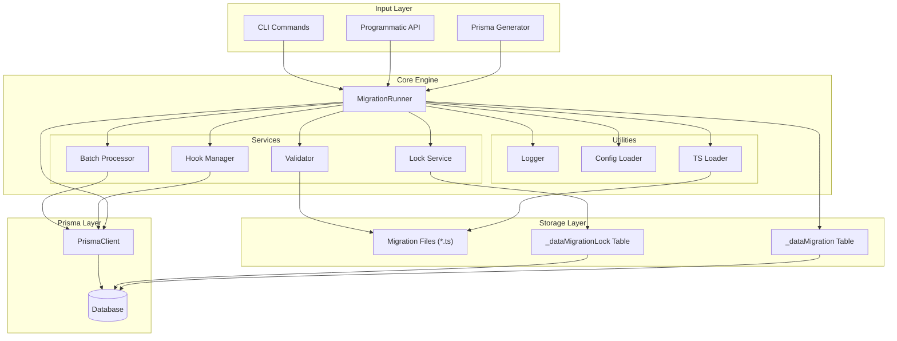
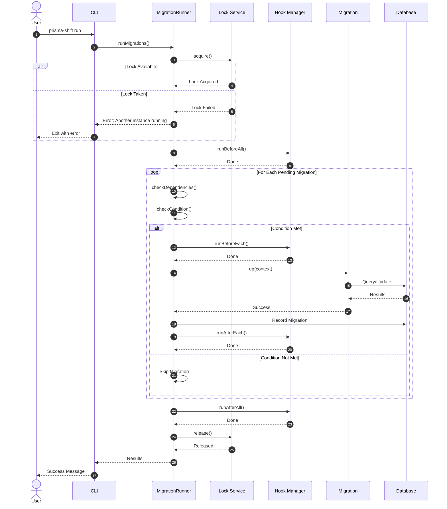
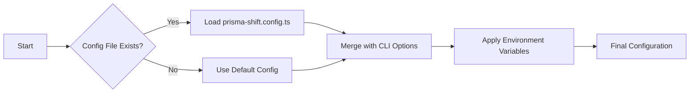
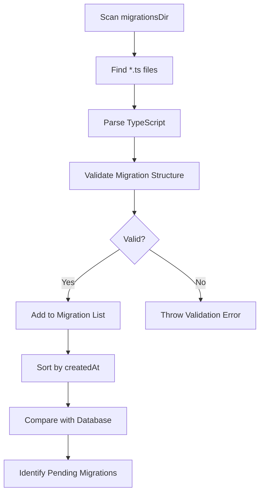
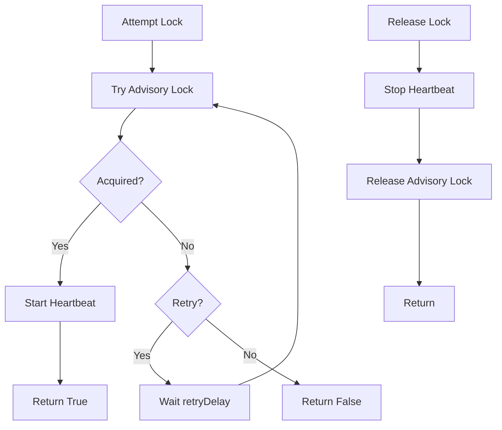

# Architecture

## System Overview

Prisma Shift is built with a modular architecture that separates concerns while providing a cohesive experience for managing data migrations.

<div class="diagram">



</div>

## Migration Execution Flow

<div class="diagram">



</div>

## Data Flow

### 1. Configuration Loading

<div class="diagram">



</div>

### 2. Migration Discovery

<div class="diagram">



</div>

### 3. Lock Acquisition (Distributed)

<div class="diagram">



</div>

## Component Details

### MigrationRunner

The central orchestrator that coordinates all migration activities.

```typescript
class MigrationRunner {
  constructor(prisma: PrismaClient, options: MigrationOptions)
  
  // Core methods
  async runMigrations(options?: RunOptions): Promise<MigrationResult>
  async rollbackLast(): Promise<boolean>
  async getStatus(): Promise<MigrationStatus>
  
  // Internal
  private async executeMigration(migration: DataMigration)
  private async checkDependencies(migration: DataMigration)
  private async checkCondition(migration: DataMigration)
  private createContext(signal?: AbortSignal): MigrationContext
}
```

### Lock Service

Prevents concurrent migration execution using PostgreSQL advisory locks.

```typescript
interface Lock {
  acquire(): Promise<boolean>
  release(): Promise<void>
  extend(additionalTime: number): Promise<boolean>
  isHeld(): boolean
}

class DatabaseLock implements Lock {
  // Uses pg_advisory_lock for PostgreSQL
  // Falls back to table-based locking for other databases
}
```

### Batch Processor

Handles large dataset processing with pagination and progress tracking.

```typescript
async function batchProcess<T>(options: BatchOptions<T>): Promise<BatchResult<T>>

interface BatchOptions<T> {
  query: () => Promise<T[]>
  batchSize: number
  process: (items: T[]) => Promise<void>
  onProgress?: (processed: number, total: number) => void
}
```

### Hook Manager

Executes lifecycle scripts at various migration stages.

```typescript
class HookManager {
  async runBeforeAll(prisma: PrismaClient, logger: Logger)
  async runBeforeEach(prisma: PrismaClient, logger: Logger, migration: MigrationInfo)
  async runAfterEach(prisma: PrismaClient, logger: Logger, migration: MigrationInfo)
  async runAfterAll(prisma: PrismaClient, logger: Logger)
}
```

## Database Schema

### Migration History Table

```sql
CREATE TABLE "_dataMigration" (
  "id" TEXT PRIMARY KEY,
  "name" TEXT NOT NULL,
  "createdAt" TIMESTAMP NOT NULL,
  "executedAt" TIMESTAMP NOT NULL DEFAULT CURRENT_TIMESTAMP,
  "duration" INTEGER NOT NULL  -- milliseconds
);
```

### Lock Table (Fallback)

```sql
CREATE TABLE "_dataMigrationLock" (
  "id" TEXT PRIMARY KEY,
  "acquiredAt" TIMESTAMP NOT NULL DEFAULT CURRENT_TIMESTAMP,
  "expiresAt" TIMESTAMP NOT NULL
);
```

## File Structure

```
src/
├── index.ts                 # Main exports
├── cli.ts                   # CLI entry point
├── migration-runner.ts      # Core runner
├── types.ts                 # TypeScript interfaces
├── config.ts                # Configuration loading
├── logger.ts                # Structured logging
├── lock.ts                  # Distributed locking
├── hooks.ts                 # Lifecycle hooks
├── batch.ts                 # Batch processing
├── validation.ts            # Migration validation
├── export.ts                # Report export
├── utils.ts                 # Utilities
└── extension.ts             # Prisma Client extension
```

## Extension Points

### Custom Logger

```typescript
const runner = new MigrationRunner(prisma, {
  logger: {
    info: (msg, meta) => console.log(`[INFO] ${msg}`, meta),
    error: (msg, error) => console.error(`[ERROR] ${msg}`, error),
    migrationStart: (id) => console.log(`Starting ${id}`),
    migrationEnd: (id, duration) => console.log(`Finished ${id} in ${duration}ms`),
  }
})
```

### Custom Lock

```typescript
const runner = new MigrationRunner(prisma, {
  lock: {
    enabled: true,
    timeout: 60000,
    retryAttempts: 5,
    retryDelay: 2000,
  }
})
```

### Custom Hooks

```typescript
// prisma-shift.config.ts
export default {
  hooks: {
    beforeAll: "./scripts/backup.ts",
    beforeEach: "./scripts/notify-start.ts",
    afterEach: "./scripts/verify.ts",
    afterAll: "./scripts/cleanup.ts",
  }
}
```

## Security Considerations

1. **Lock Timeout**: Prevents deadlocks by auto-expiring locks
2. **Transaction Safety**: Default transaction wrapping prevents partial migrations
3. **Input Validation**: All migration files are validated before execution
4. **Dependency Checking**: Ensures migrations run in correct order

## Performance

- **Batch Processing**: Configurable batch sizes for large datasets
- **Connection Pooling**: Works with Prisma's connection pool
- **Lazy Loading**: Migrations loaded only when needed
- **Heartbeat**: Lock extension prevents timeout during long migrations
