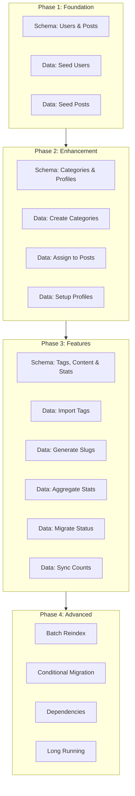
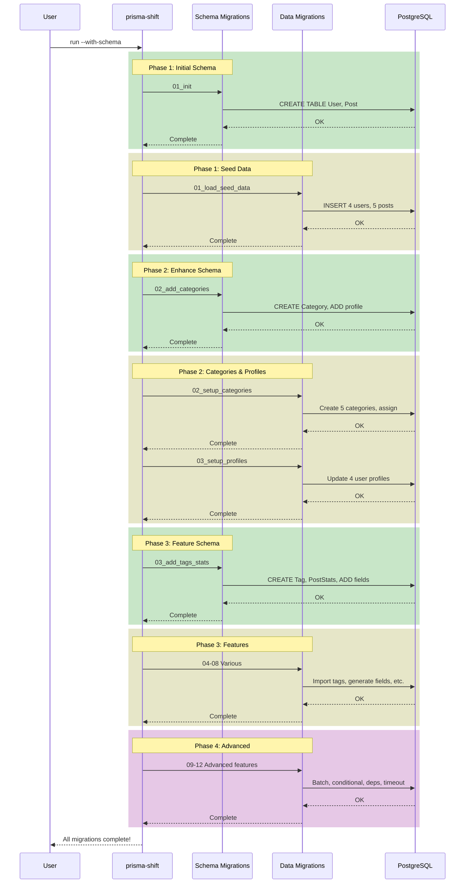

# Unified Demo Example

## Overview

The **Unified Demo** is a comprehensive example showcasing all features of Prisma Shift. It simulates a blog platform that evolves through multiple schema and data migrations.

<div class="diagram">



</div>

## What's Included

### Schema Migrations (3 SQL Files)

| # | Migration | Creates | Purpose |
|---|-----------|---------|---------|
| 1 | `20240324000001_init` | User, Post tables | Initial blog schema |
| 2 | `20240324000002_add_categories_and_profiles` | Category table, User.profile | Categorization & profiles |
| 3 | `20240324000003_add_tags_content_and_stats` | Tag, PostStats tables, Post fields | Complete feature set |

### Data Migrations (12 TypeScript Files)

| # | Migration | Pattern | Feature |
|---|-----------|---------|---------|
| 1 | `01_load_seed_data.ts` | JSON Loading | Seed initial data |
| 2 | `02_setup_categories.ts` | Backfill | Create & assign categories |
| 3 | `03_setup_user_profiles.ts` | Config Loading | Apply default settings |
| 4 | `04_import_tags.ts` | Many-to-Many | Import and link tags |
| 5 | `05_generate_content_fields.ts` | Computed Fields | Slugs, excerpts, reading time |
| 6 | `06_aggregate_post_stats.ts` | Large Dataset | Batch process statistics |
| 7 | `07_migrate_status_values.ts` | Enum Migration | Transform status values |
| 8 | `08_sync_user_counts.ts` | Multi-Table Sync | Aggregate user post counts |
| 9 | `09_batch_reindex_posts.ts` | **Batch Processing** | Process with progress tracking |
| 10 | `10_conditional_feature_flag.ts` | **Conditional** | Feature flag based execution |
| 11 | `11_dependency_migration.ts` | **Dependencies** | Ensure prerequisites |
| 12 | `12_long_running_with_timeout.ts` | **Long-Running** | Timeout & no transaction |

## Running the Demo

### Quick Start

```bash
cd examples/unified-demo

# One command does everything
npm install && npm start
```

### Step by Step

```bash
cd examples/unified-demo

# 1. Start database
docker-compose up -d

# 2. Install dependencies
npm install

# 3. Run migrations
npm run migrate

# 4. Start demo app
npm run dev
```

### With Wait Flag (Multi-instance)

```bash
# Terminal 1
npx prisma-shift run --with-schema --wait

# Terminal 2 (will wait for Terminal 1)
npx prisma-shift run --with-schema --wait
```

## Project Structure

```
unified-demo/
├── docker-compose.yml              # PostgreSQL + Adminer
├── prisma/
│   ├── schema.prisma               # Final schema
│   ├── migrations/                 # Schema migrations
│   │   ├── 20240324000001_init/
│   │   ├── 20240324000002_add_categories_and_profiles/
│   │   └── 20240324000003_add_tags_content_and_stats/
│   └── data-migrations/            # Data migrations
│       ├── 01_load_seed_data.ts
│       ├── 02_setup_categories.ts
│       ├── 03_setup_user_profiles.ts
│       ├── 04_import_tags.ts
│       ├── 05_generate_content_fields.ts
│       ├── 06_aggregate_post_stats.ts
│       ├── 07_migrate_status_values.ts
│       ├── 08_sync_user_counts.ts
│       ├── 09_batch_reindex_posts.ts
│       ├── 10_conditional_feature_flag.ts
│       ├── 11_dependency_migration.ts
│       └── 12_long_running_with_timeout.ts
├── data/                           # JSON data files
│   ├── seed-users.json
│   ├── seed-posts.json
│   ├── categories.json
│   ├── tags.json
│   └── default-settings.json
└── src/
    └── app.ts                      # Demo application
```

## Migration Flow

<div class="diagram">



</div>

## Key Features Demonstrated

### 1. Batch Processing (`09_batch_reindex_posts.ts`)

```typescript
await batch({
  query: () => prisma.post.findMany({
    select: { id: true, title: true, content: true }
  }),
  batchSize: 10,
  process: async (posts) => {
    // Process each batch
    for (const post of posts) {
      await prisma.post.update({
        where: { id: post.id },
        data: { viewCount: { increment: 1 } }
      });
    }
  },
  onProgress: (current, total) => {
    log(`Reindexed ${current}/${total} posts`);
  }
});
```

### 2. Conditional Migration (`10_conditional_feature_flag.ts`)

```typescript
condition: async ({ prisma }) => {
  const config = await prisma.config.findFirst();
  return config?.analyticsEnabled === true;
},

async up({ prisma, log }) {
  log("Analytics feature is enabled, setting up analytics data...");
  // Only runs if analytics is enabled
}
```

### 3. Migration Dependencies (`11_dependency_migration.ts`)

```typescript
requiresData: [
  "20240324010009_batch_reindex_posts",
  "20240324010010_conditional_feature_flag"
],

async up({ prisma, log }) {
  // Guaranteed that reindex and feature flag migrations completed
  const posts = await prisma.post.findMany({
    where: { viewCount: { gt: 0 } }
  });
}
```

### 4. Long-Running with Timeout (`12_long_running_with_timeout.ts`)

```typescript
const migration: DataMigration = {
  id: "20240324010012_long_running_with_timeout",
  name: "long_running_with_timeout",
  
  timeout: 120000,  // 2 minute timeout
  disableTransaction: true,  // Run outside transaction
  
  async up({ prisma, log, signal }) {
    log("Timeout set to: 120 seconds");
    
    const posts = await prisma.post.findMany();
    
    for (let i = 0; i < posts.length; i++) {
      // Check for cancellation
      if (signal?.aborted) {
        throw new Error("Migration was aborted: " + signal.reason);
      }
      
      await processPost(posts[i]);
      
      if ((i + 1) % 2 === 0) {
        log(`Progress: ${i + 1}/${posts.length} posts processed`);
      }
    }
  }
};
```

## Viewing Results

### Prisma Studio

```bash
npm run studio
```

Opens http://localhost:5555 for visual database exploration.

### Adminer (Database UI)

Open http://localhost:8080 and login with:
- System: PostgreSQL
- Server: postgres
- Username: bloguser
- Password: blogpass
- Database: blog_demo

### Demo Application

```bash
npm run dev
```

Shows processed data including:
- Users with profiles and preferences
- Posts with computed fields (slug, excerpt, reading time)
- Categories with assigned posts
- Tags linked to posts
- Statistics and aggregations

## Configuration

The demo uses a configuration file (`prisma-shift.config.ts`):

```typescript
import { Config } from "prisma-shift";

export default {
  migrationsDir: "./prisma/data-migrations",
  migrationsTable: "_dataMigration",
  schemaPath: "./prisma/schema.prisma",
  
  logging: {
    level: "info",
    progress: true,
    format: "text"
  },
  
  lock: {
    enabled: true,
    timeout: 30000,
    retryAttempts: 3,
    retryDelay: 1000
  },
  
  execution: {
    timeout: 0,
    transaction: true
  },
  
  typescript: {
    compiler: "tsx",
    transpileOnly: true
  }
} satisfies Config;
```

## Reset and Replay

To run through all migrations again:

```bash
# Reset database
npx prisma migrate reset --force

# Clear migration records
npx prisma-shift reset --force

# Run all migrations again
npx prisma-shift run --with-schema
```

Or use the Make shortcut:

```bash
make reset
```

## Next Steps

- Explore the migration files in `prisma/data-migrations/`
- Check the [Common Patterns](patterns.md) for reusable solutions
- Read the [Architecture](../architecture.md) to understand how it works
