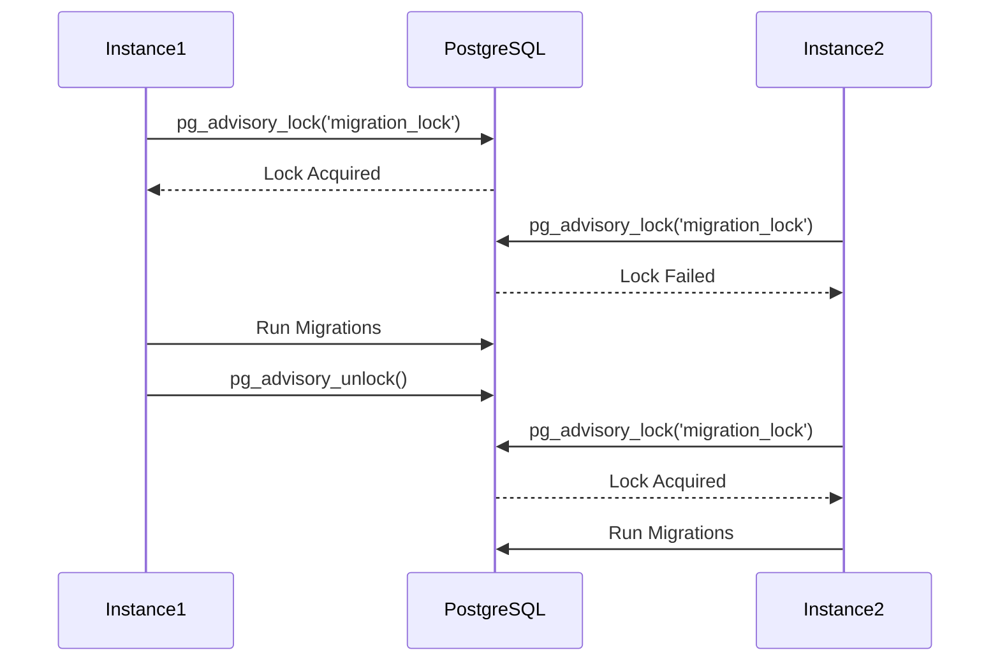

# Distributed Locking

Prevent concurrent migrations in multi-instance deployments.

## How It Works

<div class="diagram">



</div>

## Configuration

```typescript
// prisma-shift.config.ts
export default {
  lock: {
    enabled: true,
    timeout: 30000,      // Lock expires after 30s
    retryAttempts: 3,    // Retry 3 times
    retryDelay: 1000,    // Wait 1s between retries
  },
};
```

## CLI Usage

### Fail Fast (Default)

```bash
npx prisma-shift run
# Error: Could not acquire migration lock. Another instance may be running migrations.
```

### Wait for Lock

```bash
npx prisma-shift run --wait
# Waiting to acquire migration lock...
# Another instance is running migrations. Waiting...
# Lock acquired after 4 attempt(s)
```

## Heartbeat

Locks are automatically extended while migrations are running.

## Fallback

For non-PostgreSQL databases, a table-based lock is used.
